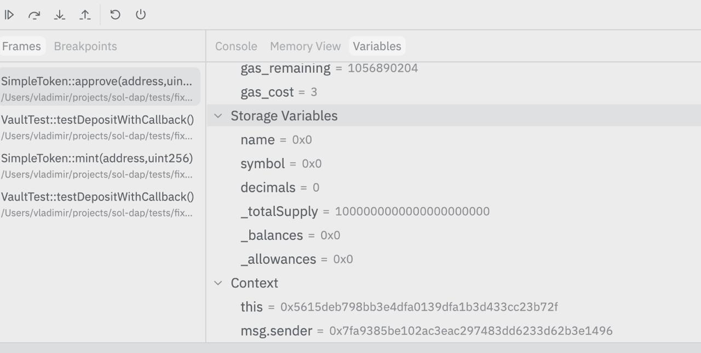
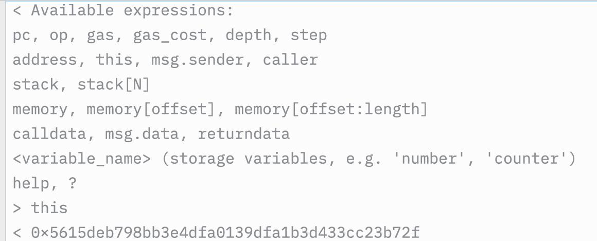

# sol-dap — Debug Adapter Protocol server for Foundry Solidity debugger

> **⚠️ Early MVP — mostly vibe-coded.** This project is in a very early stage. Expect rough edges, missing features, and breaking changes. Contributions and bug reports are welcome, but set your expectations accordingly.

sol-dap is a Debug Adapter Protocol (DAP) server that brings Foundry's Solidity debugging capabilities to any IDE or editor that supports DAP, such as Zed, VS Code, or Neovim.

<p align="center">
  
  <br>
  <em>Variables, storage, and call stack inspection</em>
</p>

<p align="center">
  
  <br>
  <em>Debug console with expression evaluation</em>
</p>

## Features

- **Post-mortem Debugging**: sol-dap runs the entire test or script first, captures the full execution trace, and then allows you to navigate it. This makes stepping instant and allows for stepping backwards.
- **Stepping**: Step Over, Step In, Step Out, and Step Back.
- **Breakpoints**: Set line breakpoints in Solidity source files.
- **Stack Inspection**: View the EVM stack for each call frame.
- **Memory Inspection**: View the EVM memory state.
- **Calldata & Return Data**: Inspect input and output data for each call.
- **Source Mapping**: Automatically maps EVM instructions back to Solidity source code.
- **Evaluate Expressions**: Basic support for evaluating expressions like `pc`, `op`, `gas`, `address`, and `stack[i]`.
- **Restart & Terminate**: Easily restart the debugging session or terminate it.

## Prerequisites

- **Rust**: 1.89 or later.
- **Foundry**: `forge` must be installed and available in your `PATH`. sol-dap relies on `forge test --debug --dump` to generate execution traces.

## Installation

Install from source:

```bash
cargo install --path .
```

## How It Works

sol-dap implements a post-mortem debugging approach. When a debug session starts, it:
1. Shells out to `forge` to run the specified test with the `--debug --dump` flags.
2. Captures the resulting execution trace and source maps.
3. Provides a DAP interface to navigate this recorded trace.

Since the trace is pre-recorded, stepping is instantaneous and you can step backwards through time. However, you cannot modify state or perform "live" execution during the debug session.

## Zed Editor Configuration

To use sol-dap in the Zed editor, add a launch configuration to your `.zed/debug.json` file. Select a test function name in the editor, then run the debug task:

### Example `.zed/debug.json`

```json
[
  {
    "label": "Debug selected test",
    "adapter": "sol-dap",
    "request": "launch",
    "project_root": "$ZED_WORKTREE_ROOT",
    "test": "$ZED_SELECTED_TEXT"
  }
]
```

Select the test function name (e.g. `testTransfer`), then run **Debug: Start** from the command palette.

## Launch Configuration Options

The following fields are supported in the `launch` request configuration:

| Field | Type | Required | Description |
|-------|------|----------|-------------|
| `project_root` | string | Yes | Path to the Foundry project root. |
| `test` | string | Yes | Name of the test function to debug. |
| `contract` | string | No | Name of the contract containing the test. |

## Supported DAP Features

| Feature | Supported | Notes |
|---------|-----------|-------|
| Initialize | Yes | Sets up capabilities. |
| Launch | Yes | Compiles and runs Foundry to get the trace. |
| Threads | Yes | Single "EVM Execution" thread. |
| StackTrace | Yes | Shows the call stack. |
| Scopes | Yes | Stack, Memory, Calldata, and Return Data. |
| Variables | Yes | Inspects values within scopes. |
| Continue | Yes | Runs until the next breakpoint or end of trace. |
| Next | Yes | Step over. |
| StepIn | Yes | Step into. |
| StepOut | Yes | Step out. |
| StepBack | Yes | Step back one opcode. |
| Pause | Yes | Breaks execution. |
| SetBreakpoints | Yes | Line-based source breakpoints. |
| Evaluate | Yes | Supports `pc`, `op`, `gas`, `address`, `stack[i]`. |
| Restart | Yes | Re-runs the Foundry command and restarts the session. |
| Terminate | Yes | Ends the session. |
| Disconnect | Yes | Cleans up the session. |

## Architecture

- `src/main.rs`: Entry point, handles the DAP server loop.
- `src/handler.rs`: Dispatches DAP requests to the appropriate session methods.
- `src/session.rs`: Manages the state of a debugging session, including the execution trace.
- `src/launch.rs`: Handles shelling out to `forge` and parsing the output.
- `src/config.rs`: Defines the launch configuration schema.
- `src/source_map.rs`: Logic for mapping EVM instructions to Solidity source locations.
- `src/variables.rs`: Logic for extracting variables from EVM state (stack, memory, etc.).

## License

This project is licensed under either the [MIT License](LICENSE-MIT) or the [Apache License, Version 2.0](LICENSE-APACHE) at your option.
